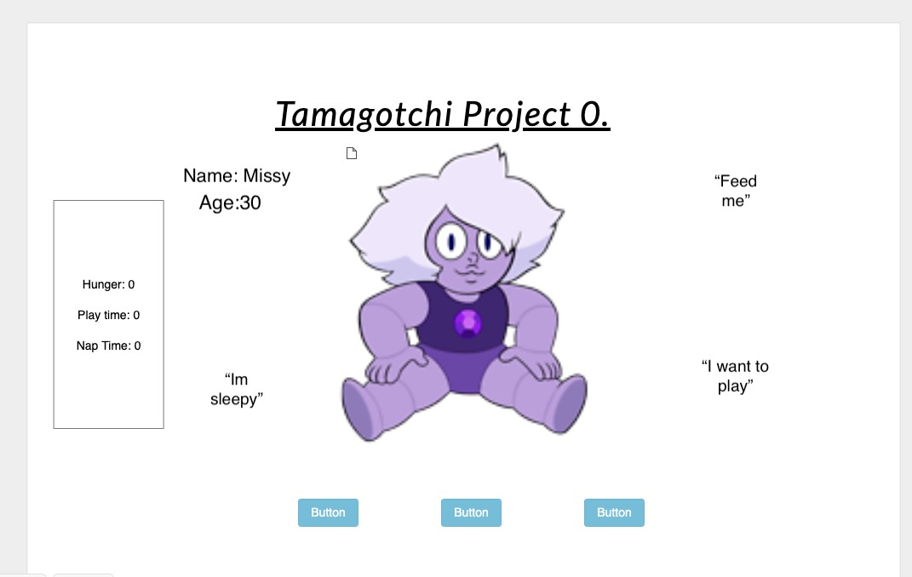

# Tamagotchi Project 

## What is Tamagotchi Project?

Tamagotchi Project is similar to a Tamagotchi digital pet back in the early 2000's with a little twist. The foundation of the game is still the same where you have to feed, play and put your pet to sleep. But with a different character and theme. I pulled inspiration for the theme from an animated television series called Steven Universe. 

## User Story  

* As a user when I click on the play button I want the game to start.
* As a user I want to be able to type into a textbox to change my pets name. 
* As a user when I am playing the game I want to see my pet as I play.
* As a user when I look at the game I want to see how hungry, sleepy and bored my pet is.
* As a user when I look at the game I want to see how old my pet is.
* As a user when my pet's hunger, sleepyiness or bordom equals 10 I want the pet to die and the game to be over.
* As a user I want my pet to get hungry, sleepy and bored every few seconds.
* As a user after every few seconds the pets age will go up by one.
* As a user I want to have a button to click on to feed, play with, and make my pet go to sleep.

## Stretch Goals

* Add neon color to my font.
* Add text comments.
* Add animation to pet.
* Add sound to pet. 

## Wireframe 

## Technologies 

* HTML
* CSS
* JS

